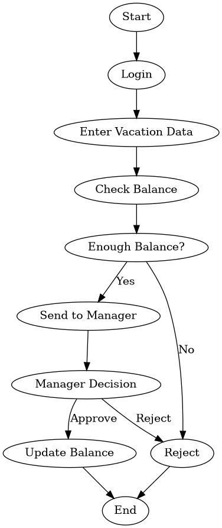
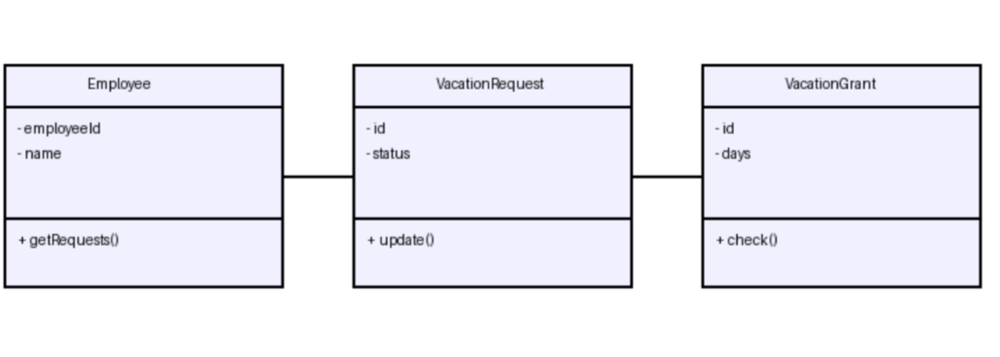

# Vacation Tracking System

##  Task 1: Requirements

### Vision
System to manage employee vacation requests and approvals.

### Functional Requirements
- Create vacation request
- Edit request
- Delete request
- View request status
- Manager approves/rejects requests

### Non-Functional Requirements
- Security
- Performance
- Scalability

### Constraints
- HR policies
- Company rules
- Working hours

---

##  Task 2: Domain

### Problem
Manual vacation handling causes errors and inefficiency.

### Solution
Automated system to manage requests and approvals.

---

##  Task 3: Actors
- Employee
- Manager
- HR

---

##  Task 4: Manage Time

### Data Model
- Employee (id, name, vacationBalance)
- Manager (id, name)
- VacationRequest (id, employeeId, startDate, endDate, status)

---

### Flowchart

---

### Entity Diagram

---

### Sequence Diagram

